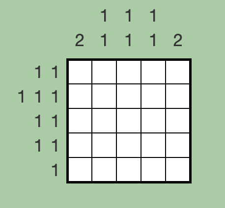

# NemoLogicSolver

NemoLogicSolver is a Java library for solving Nemonemo logic puzzles. It provides a flexible and efficient solution for solving puzzles of this type.



[This Puzzle URL](http://nemonemologic.com/play_logic.php?quid=1)

You can use this library for the above puzzle to get output like this:

```
□■□■□
■□■□■
■□□□■
□■□■□
□□■□□
```


## Features

- Solves Nemonemo logic puzzles with various configurations.
- Supports Java 8.
- Integrates with popular libraries such as Jsoup and json-simple.

## Getting Started

### Prerequisites

- Java 8 or later

### Installation

#### Maven

```xml
<dependency>
    <groupId>com.story4g.nalutbae</groupId>
    <artifactId>nemologic</artifactId>
    <version>0.0.1</version>
</dependency>
```

#### Gradle

```gradle
implementation 'com.story4g.nalutbae:nemologic:0.0.1'
```

### Usage

1. Initialize NemoLogicSolver with row and column hints:

```java
int[][] rowsHints = { /* Your row hints here */ };
int[][] columnHints = { /* Your column hints here */ };

NemoLogicSolver solver = new NemoLogicSolver(rowsHints, columnHints);
```

For the puzzle example above, you need to pass the following hint parameter:

```java
int[][] rowsHints = {{1, 1}, {1, 1, 1}, {1, 1}, {1, 1}, {1}};
int[][] columnHints = {{2}, {1, 1}, {1, 1}, {1, 1}, {2}};
```

2. Process and solve the puzzle:

```java
solver.process();
```

Check out some additional test examples:
[Test Codes]([NemoLogicSolverTest.java](src/test/java/com/story4g/nalutbae/nemologic/NemoLogicSolverTest.java))

### Dependencies
- Jsoup - Java HTML Parser
- json-simple - A simple Java toolkit for JSON

### License
This project is licensed under the [The Apache License, Version 2.0](https://www.apache.org/licenses/LICENSE-2.0.txt)